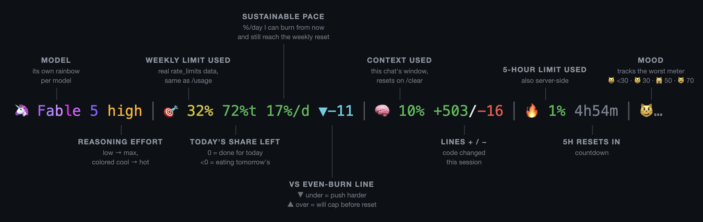

<div align="center">

# claude-statusline-burnrate

**Stop opening `/usage`. It's all right there.**




</div>

Real server-side `rate_limits` — the same numbers `/usage` shows — answers what you actually want: **am I ok, and how hard can I push?** Pure bash + jq. No node, no daemons, no estimates.

The pacing math counts awake hours, so the trend doesn't fall "behind" every night while you sleep.

## Install

Needs `jq` and Claude Code v2.1+.

```bash
curl -fsSL https://raw.githubusercontent.com/Gui-Gou/claude-statusline-burnrate/main/statusline.sh -o ~/.claude/statusline.sh
chmod +x ~/.claude/statusline.sh
```

Add to `~/.claude/settings.json`:

```json
{
  "statusLine": { "type": "command", "command": "~/.claude/statusline.sh" }
}
```

Open a new session. That's it.

## Try it first

```bash
git clone https://github.com/Gui-Gou/claude-statusline-burnrate && cd claude-statusline-burnrate
./demo.sh          # the four states below, fake data
./demo.sh --live   # animated
```


## Tweak

| Variable | Default | |
|---|---|---|
| `SL_DAY_START` | `2` | Hour your day flips (2 = 2am) |
| `SL_SLEEP_HOURS` | `6` | Hours after that spent asleep — zero-weight in the pacing math |

Colors, thresholds, mascots, cat moods: each is a short `case` block in ~300 lines of commented bash. Make it yours.

---

A ⭐ helps the next dev find it before a rate-limit panic.

MIT
