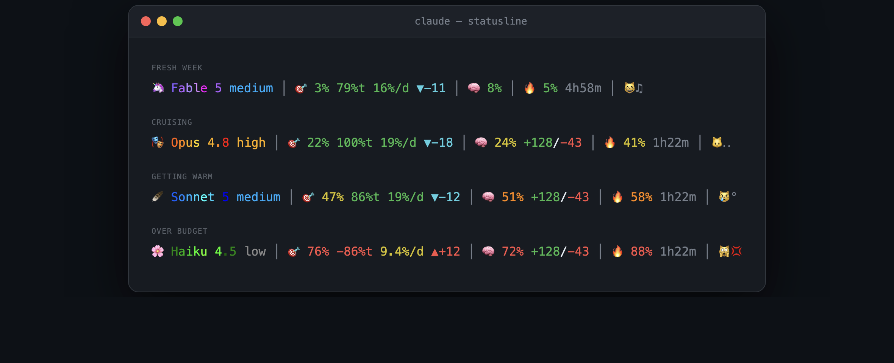

<div align="center">

# 🎯 claude-statusline-burnrate

**A Claude Code status line that does the weekly-limit math for you.**

Real server-side usage · today's share of the week · the burn rate you can sustain · sleep-aware pacing


</div>

No estimates, no background daemons, no node. Claude Code v2.1+ pipes the real `rate_limits` numbers into every status line render — the same ones `/usage` shows — and this script turns them into the answer you actually want: **am I ok, and how hard can I push?**

## 🧭 Anatomy

| | Group | Example | What it tells you |
|---|---|---|---|
| 🦄 | Model | `Fable 5 high` | Model name in its own drifting rainbow + effort level, colored cool → hot |
| 🎯 | Weekly budget | `32% 72%t 17%/d ▼-11` | The whole point of this repo — [next section](#-the-weekly-group) |
| 🧠 | This session | `10% +503/-16` | Context window fill + lines added/removed |
| 🔥 | 5h window | `1% 4h54m` | Real 5-hour usage + time until it resets |
| 😼 | Mood | `😼…` | Animated companion, reacts to the worst meter |

Groups with no data just vanish — no dangling separators on older Claude Code versions or fresh sessions.

## 🎯 The weekly group

Reading `🎯 32% 72%t 17%/d ▼-11` left to right:

| Value | Name | How to read it |
|---|---|---|
| `32%` | used | Weekly usage from `rate_limits.seven_day`. Server-side truth, not token math |
| `72%t` | today | How much of *today's* fair share of the week is left. `0` = done for today, negative = you're eating tomorrow's share |
| `17%/d` | pace | The burn rate you can sustain from this exact moment and still reach the weekly reset. A fresh week starts at `14.3` |
| `▼-11` | trend | Points under (`▼` cyan — push harder) or over (`▲` red — you'll cap early) the even-burn line. `✓` = within ±3 |

The math has one opinion baked in: **you sleep.** The even-burn line is drawn over awake hours only, so the trend doesn't quietly fall "behind" every night while you're not using it. Days flip at 2am, the first 6 hours are sleep — both [configurable](#%EF%B8%8F-configuration).

Bonus nerdery: the payload's weekly % is an integer, so a small self-calibrating interpolator smooths `%t` between ticks using this session's live cost. Details in the comments of [statusline.sh](statusline.sh).

## 🚦 Colors

Every meter colors itself on its own thresholds, so peripheral vision does the monitoring — you only read the numbers once something warms up.

| Meter | 🟢 green | 🟡 yellow | 🟠 orange | 🔴 red |
|---|---|---|---|---|
| 🎯 weekly · 🔥 5h | < 30% | 30–49% | 50–69% | ≥ 70% |
| 🧠 context | < 20% | 20–39% | 40–59% | ≥ 60% |
| `%t` today left | ≥ 50 | 25–49 | 10–24 | < 10 |
| `%/d` pace | ≥ 12 | 8–11 | 5–7 | < 5 |

And the four states in practice:



## 📦 Install

Needs `jq` and Claude Code v2.1+ (older versions don't expose `rate_limits`).

```bash
curl -fsSL https://raw.githubusercontent.com/Gui-Gou/claude-statusline-burnrate/main/statusline.sh -o ~/.claude/statusline.sh
chmod +x ~/.claude/statusline.sh
```

Then point Claude Code at it in `~/.claude/settings.json`:

```json
{
  "statusLine": { "type": "command", "command": "~/.claude/statusline.sh" }
}
```

Open a new session and the line shows up at the bottom. That's it.

## 🧪 Try it first

```bash
git clone https://github.com/Gui-Gou/claude-statusline-burnrate && cd claude-statusline-burnrate
./demo.sh          # the four states above, fake data
./demo.sh --live   # animated — the rainbow drifts, the cat moves
```

## ⚙️ Configuration

| Variable | Default | What it does |
|---|---|---|
| `SL_DAY_START` | `2` | Hour your day flips (2 = 2am). Budget "days" run from here to here |
| `SL_SLEEP_HOURS` | `6` | Hours after day-start that count as sleep — zero-weight in all pacing math |

Set them in `settings.json`'s `env` block or export them before launch. Everything else — thresholds, hues, mascots, faces — is a short `case` block in ~300 lines of commented bash. Make it yours.

## 🎨 Model mascots

Each model gets a mascot and its own rainbow family for the drifting name:

| Model | Mascot | Rainbow |
|---|---|---|
| Opus | 🎭 | warm reds & golds |
| Sonnet | 🪶 | blues |
| Fable | 🦄 | purples & magentas |
| Haiku | 🌸 | greens |

## 🐈 The cat

Yes, there's a cat. It watches whichever meter is worst and animates while Claude streams (frames advance per render, so it rests when idle).

| Worst meter | Mood | |
|---|---|---|
| < 30% | purring | 😺😸😻 ♪♫♬ |
| 30–49% | alert | 😼🐱 ‥… |
| 50–69% | sweating | 🙀😿 💦 |
| ≥ 70% | panicking | 😾🙀 🔥💢💥 |

## 📄 License

MIT
