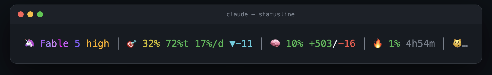

# claude-statusline-burnrate

A Claude Code status line that does the weekly-limit math for you: the real server-side %, how much of today's share of the week is left, the burn rate you can sustain to reach the reset, and whether you're ahead or behind the line — every meter color-coded green → red as it climbs. There's also a cat.



One line, five groups:

```
🦄 Fable 5 high │ 🎯 22% 100%t 23%/d ▼-30 │ 🧠 24% +128/-43 │ 🔥 41% 1h22m │ 😼…
   model+effort    weekly budget            this session       5h window     cat
```

- **🎯 weekly** is the real server-side number from `rate_limits.seven_day`, not an estimate. Next to it: how much of *today's* slice of the week you have left (`%t`), the burn rate you can sustain to make it to the reset (`%/d`), and whether you're ahead or behind the even-burn line (`▲`/`▼`/`✓`).
- **Every meter is color-coded on its own thresholds** — green → yellow → orange → red as it climbs — so peripheral vision does the monitoring; you only read the numbers once something warms up.
- **Model** gets its own drifting rainbow and mascot (🎭 Opus, 🪶 Sonnet, 🦄 Fable, 🌸 Haiku). Effort level colored cool→hot.
- **🧠 context** — how full this chat's window is, plus lines added/removed this session.
- **🔥 5h window** — real usage and time until it resets.
- **The cat** reacts to the worst of the three meters. Purring below 30%, sweating at 50%, on fire at 70%. It animates while Claude streams and rests when idle.

The budget math has one opinion baked in: you sleep. The "even burn" line is drawn over awake hours only, so the trend arrow doesn't tell you you're falling behind every morning just because you went to bed. Days flip at 2am and the first 6 hours are sleep — change that with two env vars (below).

No estimates, no background daemons, no node. Pure bash + jq reading the JSON Claude Code already pipes to status line commands.

## Install

Needs `jq` and Claude Code v2.1+ (older versions don't expose `rate_limits`).

```bash
curl -fsSL https://raw.githubusercontent.com/Gui-Gou/claude-statusline-burnrate/main/statusline.sh -o ~/.claude/statusline.sh
chmod +x ~/.claude/statusline.sh
```

Then point Claude Code at it — add this to `~/.claude/settings.json`:

```json
{
  "statusLine": { "type": "command", "command": "~/.claude/statusline.sh" }
}
```

Open a new session and the line shows up at the bottom. That's it.

## Try it without installing

```bash
git clone https://github.com/Gui-Gou/claude-statusline-burnrate && cd claude-statusline-burnrate
./demo.sh          # four moods, fake data
./demo.sh --live   # animated — watch the cat and the rainbow drift
```

## Tweaks

Your day probably doesn't run midnight to midnight. Mine flips at 2am and I'm asleep until 8. Set yours in `settings.json`'s `env`, or export before launch:

```bash
SL_DAY_START=2      # hour your day flips (default 2 = 2am)
SL_SLEEP_HOURS=6    # hours after that spent asleep (default 6)
```

Everything else — colors, thresholds, mascots, cat faces — is a short `case` block in the script. It's ~300 lines of commented bash; make it yours.

## How the today/pace/trend math works

Long comments in [statusline.sh](statusline.sh) explain it, but the short version: draw a straight line from 0% at the last weekly reset to 100% at the next, over awake hours only. Your real usage vs that line gives the trend arrow. The line's rise during today is today's fair share; how much of it you've eaten gives `%t`. What's left of the week divided by awake days remaining gives sustainable pace. The weekly % only arrives as an integer, so a small self-calibrating interpolator smooths between ticks using this session's live cost.

## License

MIT
